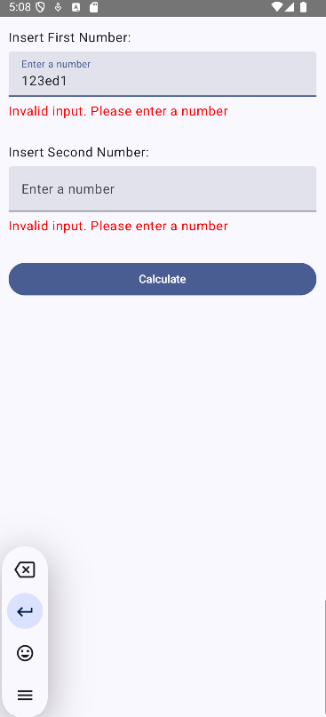
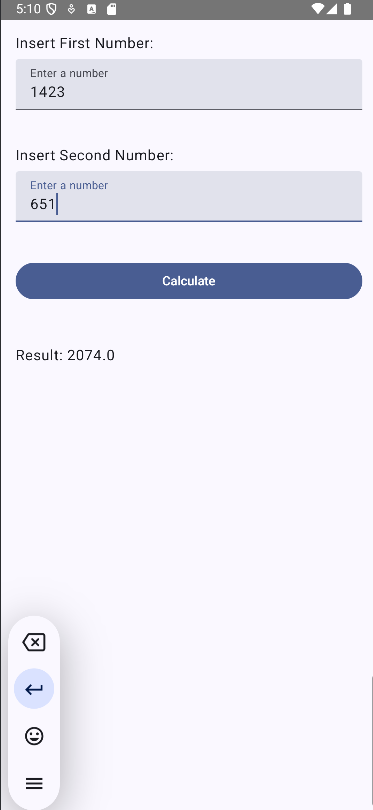

# Calculadora Que Suma

Una simple aplicación de Android desarrollada en Kotlin utilizando Jetpack Compose, que permite sumar dos números ingresados por el usuario.

## Características

- **Validación de entradas:** Muestra errores si los valores ingresados no son válidos o superan un límite de longitud.
- **Interfaz moderna:** Construida con Jetpack Compose y Material Design 3.
- **Cálculo en tiempo real:** Suma dos números y muestra el resultado al presionar un botón.

## Capturas de Pantalla





## Requisitos

- Android Studio Flamingo o superior.
- JDK 17 o superior.
- Dispositivo o emulador con Android 6.0 (API 23) o superior.

## Instalación

1. Clona este repositorio:
   ```bash
   git clone https://github.com/tu-usuario/calculadora-que-suma.git
   ```
